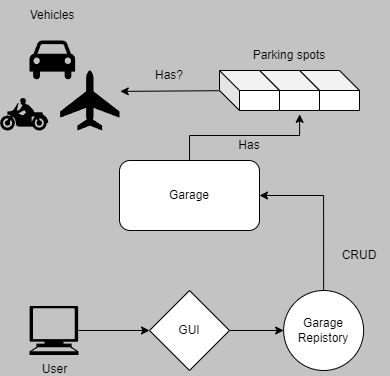

# Garage 1.0

## Description
A small application for handling registration, deregistration and data of Vehicles
stored in select Garages.

## Test/Development
```
cd garage-1.0.Console/
dotnet run
```
## Data Structure Schematic


## Disclaimer
Developed using .NET SDK 8.0.103

## Contact
[visualarea.1@gmail.com](mailto:visualarea.1@gmail.com)